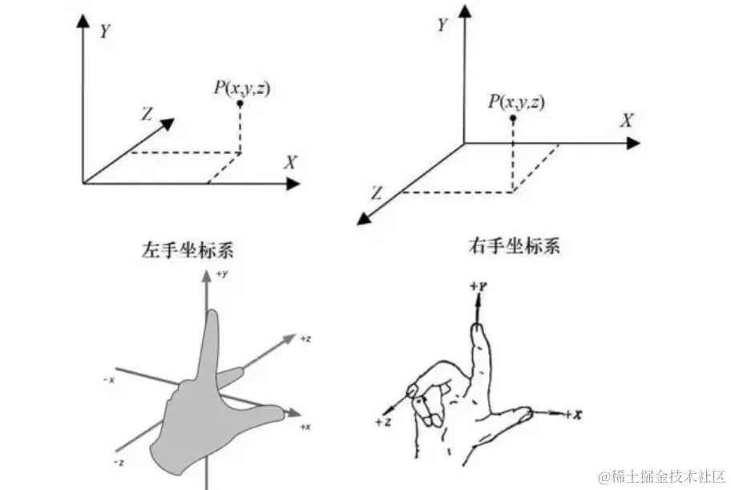

# readme

WebGL零基础快速入门教程
http://www.yanhuangxueyuan.com/WebGL/

Three.js教程
http://www.webgl3d.cn/Three.js/

three.js学习
https://threejs.org/docs/index.html#examples/zh/controls/OrbitControls

## 坐标系
参考：https://juejin.cn/post/7381784676719902759

**Three.js 使用的是右手坐标系**，而 Unity 则采用左手坐标系

大拇指 x轴，指向右边
食指 y轴，指向上边
中指 z轴，指向内侧/外侧