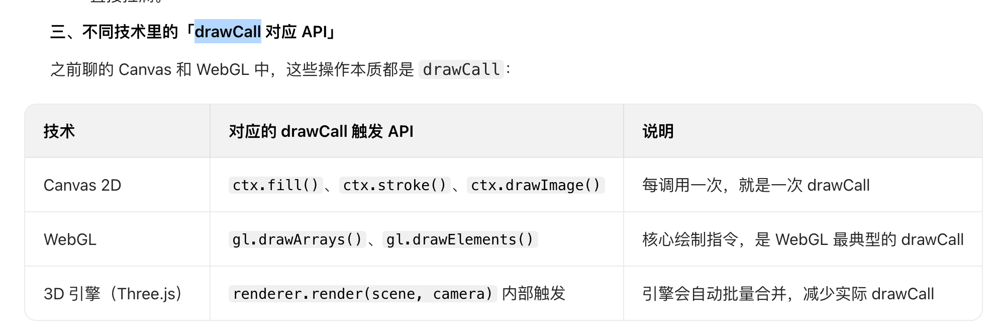

# webGL 与 canvas 高性能渲染

https://www.doubao.com/thread/w6098826fc91c715e

避免频繁修改画布尺寸：主要是因为该操作会清空画布并重建缓冲区，代价极高。
**防抖、节流**：鼠标移动、窗口 resize 等高频事件触发的渲染
使用 requestAnimationFrame 代替 setTimeout/setInterval：与浏览器刷新同步（通常 60fps），避免帧丢失和卡顿

批量绘制，不要修改一个就绘制一次
仅渲染可视区内的
使用worker
利用 WebAssembly（WASM）加速计算

Canvas：使用 Path2D 复用路径
WebGL 用 VBO（+IBO）合并顶点数据；

